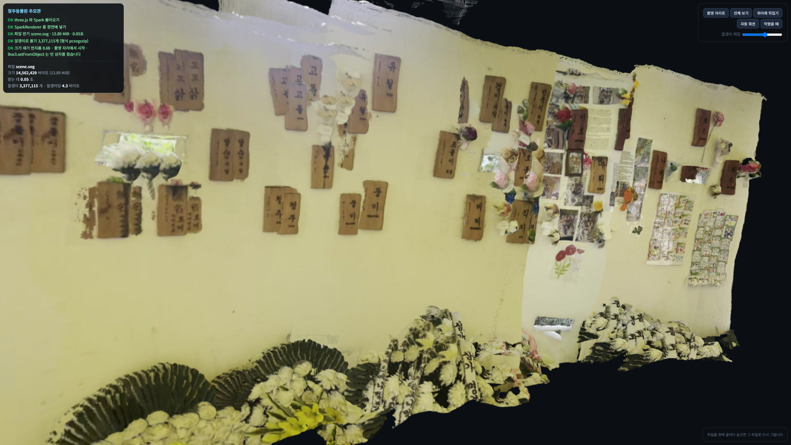

# 고른 공간

청주동물원 추모관을 폰 영상 한 편으로 3D 가우시안 스플랫으로 만들어 웹에 올린 것입니다.



## 주소

**https://songyee-ai.github.io/my-open-space/**

알갱이 파일은 `https://songyee-ai.github.io/my-open-space/scene.sog` 로 직접 열립니다.
페이지는 뜨는데 화면이 비면 이 주소부터 확인하십시오.

## 어디를 골랐나

**청주동물원 추모관.** 동물원에서 생을 마감한 동물들을 기억하고 위로하기 위해 마련된
추모 공간입니다. 곡면으로 휜 벽에 동물 이름을 새긴 나무 명패가 붙어 있고, 그 아래로
국화가 놓여 있습니다.

**공개해도 된다고 판단한 근거**

- 관람객에게 열려 있는 **공개 추모 공간**이고 촬영이 허용된 곳입니다.
- 찍힌 것은 추모 명패와 헌화뿐입니다. **사람 얼굴, 번호판, 문패, 서류는 들어 있지 않습니다.**
  프레임 24장을 전부 확인했습니다.
- 명패에 적힌 것은 **동물의 이름**이며, 애초에 기억되기 위해 공개적으로 걸린 것입니다.

## 어떻게 찍었나

| 항목 | 값 | 기준 | |
|---|---|---|---|
| 길이 | 12.81초 | 15~20초 | 짧지만 아래 판정을 통과 |
| 해상도 | 1080 × 1920 (세로) | 1080p | 충족 |
| 코덱 / 프레임 | H.265 / 382장 (29.8fps) | — | |
| 뽑은 사진 | **24장** (균등 간격, 약 16.6장마다) | 24장 | 충족 |
| 번진 사진 | **0장** (또렷함 중앙값 675) | — | |
| 모델에 들어간 크기 | 518 × 294 | — | 원본이 커도 이 크기로 줄어듭니다 |

**카메라가 퍼진 정도 — 이 과제의 판정 숫자**

```
카메라 퍼짐 2.952  /  장면 대각선 17.370  =  0.1699      (기준선 0.1 → 통과)
```

걸어 다니며 찍었다는 뜻입니다. 제자리에서 몸만 돌렸다면 이 값이 0.1 아래로 떨어지고
장면이 아치 모양으로 휘어 나옵니다. 카메라가 실제로 걸어간 총 거리는 4.125였습니다.

**나온 점 개수**

| | 개수 |
|---|---|
| 복원 직후 | 3,475,889 |
| 각 축 상하 0.5% 밖으로 튄 점 버림 | −98,774 (2.8%) |
| **남은 점 = 알갱이 개수** | **3,377,115** |

복원은 Google Colab 무료 등급 **Tesla T4**(15.64GB, 계산 능력 7.5)에서
**10.0초 / 최대 GPU 메모리 6.74GB**가 걸렸습니다.

## 형식별로 잰 값

알갱이 크기 `K = 0.5`, 반지름 0.003264, 불투명도 0.9, 1차 이상 구면 조화(`f_rest`) 없음.

| 형식 | 파일 크기(바이트) | MiB | 변환 시간 | 알갱이 개수 | 알갱이당 바이트 | 100MiB 한계 |
|---|---:|---:|---:|---:|---:|:--:|
| `.ply` (INRIA 이진) | 229,644,237 | 219.01 | — | 3,377,115 | **68.00** | 초과 |
| `.compressed.ply` | 54,984,325 | 52.44 | 3.6초 | 3,377,115 | 16.28 | 통과 |
| `.spz` | 22,322,301 | 21.29 | 3.7초 | 3,377,115 | 6.61 | 통과 |
| **`.sog`** (올린 것) | **14,562,429** | **13.89** | 4.6초 | 3,377,115 | **4.31** | 통과 |

- **네 파일의 알갱이 개수가 3,377,115개로 모두 같습니다.** 점을 솎아낸 것이 아니라
  형식만 바꾼 것임을 확인한 것입니다. `N_KEEP`은 0(전부)입니다.
- `.ply`의 알갱이당 68.00바이트는 값 17개 × 4바이트와 정확히 일치합니다.
  1차 이상 구면 조화 45칸을 헤더에 넣지 않아서 나온 값입니다. 넣었다면 236~248이 됩니다.
- 압축비는 `.compressed.ply` 4.2배, `.spz` 10.3배, `.sog` **15.8배**입니다.
- 크기 기준: 바이트를 1,048,576으로 나눈 MiB 값입니다.
- **점을 줄일 필요가 없었습니다.** 형식 변환만으로 219.01 MiB → 13.89 MiB가 되어
  깃허브 한계(100MiB)의 7분의 1이 됐습니다.

### `.spz`는 이 뷰어에서 열리지 않습니다

크기·개수는 위 표대로 정상이지만 화면에는 못 띄웁니다. 이유는 둘입니다.

1. `.spz` 규격은 gzip으로 눌러 저장하는데 splat-transform은 누르지 않고 씁니다
   (→ `Invalid gzip header`).
2. 직접 gzip으로 눌러도 `Unsupported SPZ version: 4`가 납니다.
   splat-transform이 쓰는 SPZ 4판을 Spark가 모릅니다.

Spark 2.2.0으로 올려도, splat-transform 2.7.1로 내려도 같았고, 변환 도구에 SPZ 판을
고르는 선택지가 없습니다. 뷰어에 끌어다 놓으면 위 문구가 빨간 상자로 뜹니다.

## 폰에서 첫 화면까지

<!-- TODO: 폰으로 위 주소를 열어 첫 화면이 뜰 때까지 걸린 시간을 재서 적습니다 -->

| | 시간 |
|---|---|
| 내 폰 | `(잰 값을 채웁니다)` |
| 남의 폰 | `(잰 값을 채웁니다)` |

참고로 같은 자리(로컬 서버)에서는 13.89 MiB를 받는 데 0.05초였습니다.

## 안 나온 자리

검게 남거나 지저분한 곳과 그 이유입니다.

| 어디 | 무엇이 보이나 | 왜 |
|---|---|---|
| **위쪽 가장자리** | 검은 점이 구름처럼 흩어짐 | 하늘과 나뭇잎입니다. 하늘은 무늬가 없어 거리를 못 잡고, 잎은 바람에 움직여 사진마다 자리가 다릅니다 |
| **바닥 쪽** | 통째로 검음 | 벽을 보며 걸어 거의 안 찍혔습니다 |
| **벽의 좌우 끝** | 찢긴 듯 잘림 | 영상이 시작·끝난 지점이라 그 너머는 본 적이 없습니다 |
| **국화 다발** | 뭉개져 형태가 불분명 | 꽃잎이 가늘고 겹쳐 있는데, 모델에 들어가는 사진이 518×294로 줄어들어 그 굵기가 화소 아래로 내려갑니다 |
| **명패 글씨 일부** | 겹쳐 보이는 곳이 있음 | 사진 24장의 깊이 추정이 미세하게 어긋나 같은 명패가 여러 겹으로 쌓입니다. 알갱이 크기 `K`가 이 어긋남을 덮는 역할을 겸합니다 |

하늘과 나무는 결과를 더 망칩니다. 이것들이 "아주 먼 곳"으로 잡히는 바람에 장면 최장변이
8.04(점의 92.4%가 있는 벽 부근)에서 **11.995로 부풀었습니다.** 알갱이 반지름이
`K × 최장변 / √N`이라 반지름도 같이 부풀어, `K`를 기본 1.4에서 **0.5까지 내려야**
명패 글씨가 읽혔습니다.

---

## 어떻게 다시 만드나

```
영상 → 사진 24장 → 점 337만 개 + 카메라 24대 → 가우시안 스플랫 .ply → .sog → 깃허브 페이지
```

1. **복원** (Colab T4, GPU 필요): `facebook/map-anything-apache` 로 사진 24장에서 점을 뽑습니다.
   T4(계산 능력 7.5)에서는 `amp_dtype="fp16"` 이어야 합니다. 공식 예제의 `bf16` 은
   T4에 없어서 계산이 32비트로 풀리고 메모리가 넘칩니다. **사진 8장까지는 그래도 돌기 때문에
   작게 시험하면 못 잡습니다.**
2. **알갱이로** (GPU 불필요): 좌표의 y·z 부호를 뒤집고(Y-down → Y-up),
   색을 `(색/255 − 0.5) / 0.28209479177387814` 로 바꿔 `f_dc` 에 넣고,
   불투명도는 로짓(0.9 → 2.1972), 반지름은 로그로 저장합니다.
3. **줄이기** (GPU 불필요): `npx -y @playcanvas/splat-transform@latest -w scene.ply scene.sog`

## 쓴 것

MapAnything (Apache-2.0) · three.js (MIT) · Spark 2.1.0 (MIT) · splat-transform (MIT)
